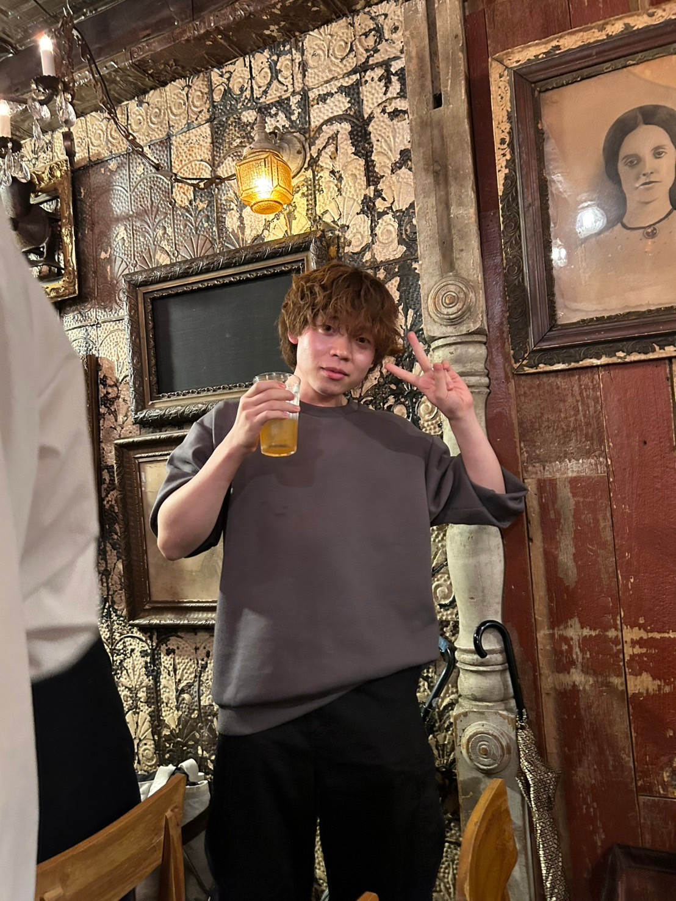
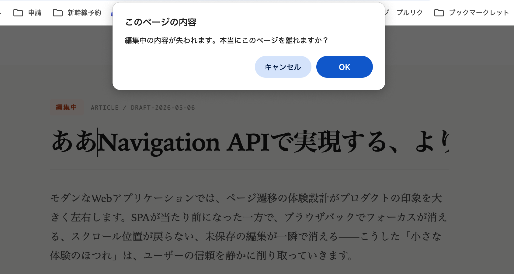
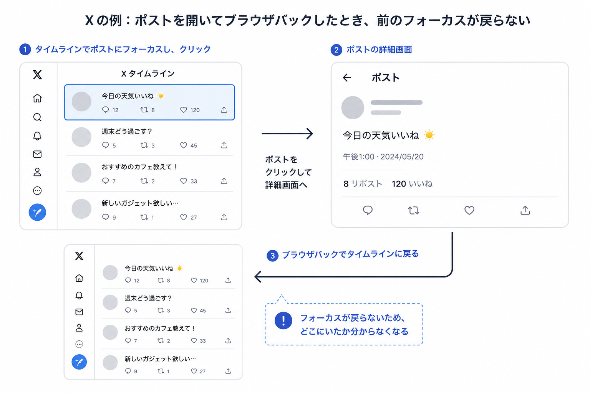

<!-- _class: title -->

`[ fukuoka.ts #4 / 2026.05.07 ]`

# Navigation *API.*

// フレームワークの先にある世界

<lt-deco>
  <lt-sticker rotate="-2">@ezakichi3207</lt-sticker>
  <lt-badge>15min LT</lt-badge>
  <lt-sticker rotate="3" color="peach">navigation</lt-sticker>
</lt-deco>


---

<!-- _class: whoami -->
<!-- header: "#self-intro" -->

<lt-kicker>$ whoami</lt-kicker>

<div class="whoami-grid">
  <div class="avatar"></div>
  <div class="info">

<p style="font-family:var(--font-mono);font-size:22px;color:var(--fg-dim);letter-spacing:0.06em;margin:0">name —</p>

## えざきち

| role   | :: | Product Engineer           |
|--------|----|----------------------------|
| org    | :: | サイボウズ株式会社 / kintone開発 |
| x      | :: | *<a href="https://x.com/ezakichi3207" target="_blank">@ezakichi3207</a>* |
| github | :: | *<a href="https://github.com/shoken3207" target="_blank">shoken3207</a>* |
| site   | :: | *<a href="https://zakki-portfolio.vercel.app/" target="_blank">zakki-portfolio</a>* |

  </div>
</div>

<div style="position:absolute;bottom:120px;right:80px;display:flex;flex-direction:column;align-items:center;gap:12px">
  
  <lt-postit rotate="-5">最近、鳥取・岡山<br>旅行に行ってきました</lt-postit>
</div>


---

<!-- _class: agenda -->
<!-- header: "#agenda" -->

## 本日 *話すこと*

1. Navigation API とは `3 min`
2. React/Next.js ユーザーに関係ある？ `2 min`
3. フレームワークでは届かないユースケース `8 min`
4. まとめ `2 min`


---

<!-- _class: section-divider -->
<!-- header: "#section" -->

—— section / 01
*what is it?*

# Navigation *API*とは

<div style="position:absolute;top:200px;right:180px">
  <lt-sticker rotate="8" color="mustard">Baseline 2026</lt-sticker>
</div>


---

<!-- _class: bullets -->
<!-- header: "#spa-routing" -->

## SPA ルーティングの *仕組み*

- **リンクをクリック → ブラウザ遷移を `preventDefault()` で止める**
  React Router の `<Link>` も内部でこれをやっている
- **`history.pushState()` で URL だけ書き換える**
  ページリロードは発生せず、アドレスバーだけ変わる
- **React が新しいコンポーネントをレンダリング**
  URL に対応する画面を JS で描画する

> つまり SPA は「ブラウザの遷移を乗っ取って JS で画面を差し替えている」。この仕組みの土台が History API


---

<!-- _class: body-text -->
<!-- header: "#key-message" -->

## この History API を置き換えるのが *Navigation API。*

> `navigate` イベント1つで、リンククリック・pushState・ブラウザバックすべてをインターセプトできる


---

<!-- _class: code-slide -->
<!-- header: "#code" -->

## これだけで *SPA ルーティング*

`router.js`

```js
navigation.addEventListener('navigate', (event) => {
  if (!event.canIntercept) return;

  event.intercept({
    async handler() {
      const html = await fetch(event.destination.url, {
        signal: event.signal, // 連続遷移で自動キャンセル
      }).then(r => r.text());
      document.querySelector('#app').innerHTML = html;
    }
  });
});
```

> History API で必要だった popstate 監視・click 横取り・AbortController が全部不要に


---

<!-- _class: body-text -->
<!-- header: "#loading-indicator" -->

## ブラウザの *ローディングインジケーター*が動く。

> pushState では無反応だったタブのスピナーが、`intercept()` を使うとブラウザがナビゲーション中であることを認識し、自動で連動する


将来的にルーターライブラリが Navigation API に対応すれば、ライブラリをアップデートするだけでこの恩恵を受けられる


---

<!-- _class: section-divider -->
<!-- header: "#section" -->

—— section / 02
*for framework users*

# React/Next.js ユーザーに *関係ある？*


---

<!-- _class: body-text -->
<!-- header: "#key-message" -->

## ルーティング自体は *フレームワークが吸収してくれる。*

> React Router や Next.js の App Router が内部で Navigation API を活用するようになるだけ。ゴリゴリ書く機会は多くない


---

<!-- _class: body-text -->
<!-- header: "#key-message" -->

## ただし、ルーターでは *カバーしきれない領域*がある。

> ページ離脱防止、フォーカス復元、遷移アニメーション — これらは Navigation API を直接使うことで、よりスマートに実現できる


---

<!-- _class: section-divider -->
<!-- header: "#section" -->

—— section / 03
*use cases*

# フレームワークでは *届かない*ところ

<div style="position:absolute;top:200px;right:180px">
  <lt-sticker rotate="8" color="peach">実践</lt-sticker>
</div>


---

<!-- _class: image-slide -->
<!-- header: "#use-case" -->

## 入力途中でのページ離脱 *確認ダイアログを表示*



入力途中で誤ってブラウザバックしてしまっても、確認ダイアログを表示して意図しないページ離脱を防ぐ


---

<!-- _class: code-slide -->
<!-- header: "#code" -->

## 入力途中でのページ離脱 *確認ダイアログを表示*

`usePreventLeave.ts`

```ts
useEffect(() => {
  const handler = (event: NavigateEvent) => {
    if (!hasUnsavedChanges) return;
    // SPA 内遷移でも確認ダイアログを表示できる
    const leave = window.confirm('変更が保存されていません。離れますか？');
    if (!leave) event.preventDefault();
  };
  navigation.addEventListener('navigate', handler);
  return () => navigation.removeEventListener('navigate', handler);
}, [hasUnsavedChanges]);
```

> `beforeunload` では SPA 内遷移を止められず、ダイアログも定型文のみ。Navigation API なら自由にカスタマイズ可能


---

<!-- _class: body-text -->
<!-- header: "#use-case" -->

## ブラウザバックしたら *元のフォーカス位置を維持*

> 履歴エントリに状態を保存できるので、戻る/進むでの復元が自然に書ける


---

<!-- _class: image-slide -->
<!-- header: "#focus-problem" -->

## ブラウザバックしたら *元のフォーカス位置を維持*



Navigation API なら履歴エントリに状態を保存できるので、これを解決できる


---

<!-- _class: code-slide -->
<!-- header: "#code" -->

## ブラウザバックしたら *元のフォーカス位置を維持*

`useFocusRestore.ts`

```ts
// 遷移前にフォーカス位置を state に保存
navigation.updateCurrentEntry({
  state: {
    ...navigation.currentEntry.getState(),
    focusedId: document.activeElement?.id,
  },
});

// 戻ってきたら復元
navigation.addEventListener('currententrychange', () => {
  const state = navigation.currentEntry.getState();
  if (state?.focusedId) {
    document.getElementById(state.focusedId)?.focus();
  }
});
```

> 履歴エントリに状態を保存できるので、戻る/進むでのフォーカス復元が自然に書ける


---

<!-- _class: body-text -->
<!-- header: "#use-case" -->

## *ページ間アニメーション*

> View Transitions API と Navigation API を組み合わせて、MPA のようなスムーズな遷移を SPA で実現


---

<!-- _class: code-slide -->
<!-- header: "#code" -->

## *ページ間アニメーション*

`router.ts`

```ts
navigation.addEventListener('navigate', (event) => {
  if (!event.canIntercept) return;

  event.intercept({
    async handler() {
      const html = await fetchPage(event.destination.url);
      // View Transitions API と組み合わせ
      document.startViewTransition(() => {
        document.querySelector('#app').innerHTML = html;
      });
    }
  });
});
```

> Navigation API + View Transitions API で、MPA のようなスムーズな遷移を SPA で実現


---

<!-- header: "#demo" -->

## *デモ*

<iframe src="https://codesandbox.io/embed/wthwqw?view=editor+%2B+preview&module=%2Fsrc%2FApp.tsx"
     style="width:100%; height: 700px; border:0; border-radius: 8px; overflow:hidden;"
     title="lt-demo"
     allow="accelerometer; ambient-light-sensor; camera; encrypted-media; geolocation; gyroscope; hid; microphone; midi; payment; usb; vr; xr-spatial-tracking"
     sandbox="allow-forms allow-modals allow-popups allow-presentation allow-same-origin allow-scripts"
   ></iframe>


---

<!-- _class: compare -->
<!-- header: "#result" -->

## Navigation API で *スマートになること*

<lt-compare>
<lt-panel type="before">

### 従来

- beforeunload で離脱防止（SPA 内遷移は不可）
- フォーカス位置は自前で保存・復元
- 遷移アニメーションはルーター依存

</lt-panel>
<lt-panel type="after">

### Navigation API

- navigate イベントで SPA 内遷移もブロック
- 履歴エントリの state でフォーカス保存
- View Transitions と自然に連携

</lt-panel>
</lt-compare>


---

<!-- _class: bullets -->
<!-- header: "#tips" -->

## まとめ

- **ルーティング自体はフレームワークに任せてOK**
  Navigation API を直接書く必要はほとんどない
- **ルーターがカバーしない UX 改善に使える**
  離脱防止・フォーカス復元・遷移アニメーションは直接使う価値あり
- **Baseline 2026 — 今日から使える**
  `if ('navigation' in window)` でフォールバックも容易


---

<!-- _class: closing -->
<!-- header: "#outro" -->

— fin

# Thank *you.*

Navigation API はフレームワークの「その先」を支える API

<lt-deco>
  <lt-sticker rotate="-2">@ezakichi3207</lt-sticker>
  <lt-badge>questions / comments</lt-badge>
  <lt-sticker rotate="4" color="peach">thx!</lt-sticker>
</lt-deco>


<lt-prompt>logout</lt-prompt>
