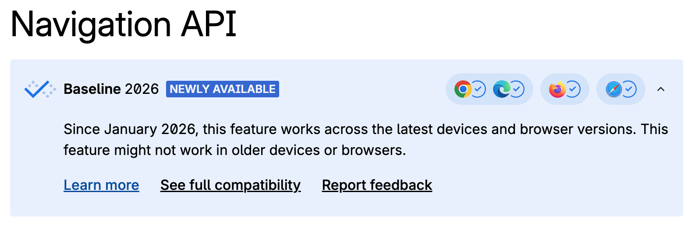
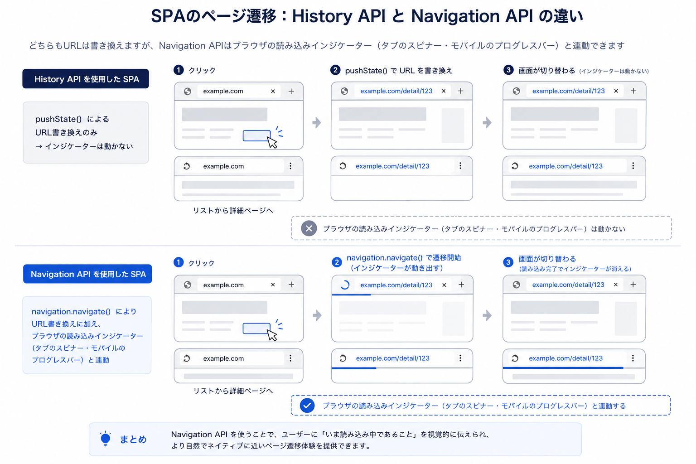

<!-- _class: title -->

`[ fukuoka.ts #4 / 2026.05.07 ]`

# Navigation *API.*

// SPAに適した新しいルーティングAPI

<lt-deco>
  <lt-sticker rotate="-2">@ezakichi3207</lt-sticker>
  <lt-badge>15min LT</lt-badge>
  <lt-sticker rotate="3" color="peach">navigation</lt-sticker>
</lt-deco>


---

<!-- _class: whoami -->
<!-- header: "#self-intro" -->

<lt-kicker>$ whoami</lt-kicker>

<div class="whoami-grid">
  <div class="avatar"></div>
  <div class="info">

<p style="font-family:var(--font-mono);font-size:22px;color:var(--fg-dim);letter-spacing:0.06em;margin:0">name —</p>

## えざきち

| role   | :: | Product Engineer           |
|--------|----|----------------------------|
| org    | :: | サイボウズ株式会社 / kintone開発 |
| x      | :: | *<a href="https://x.com/ezakichi3207" target="_blank">@ezakichi3207</a>* |
| github | :: | *<a href="https://github.com/shoken3207" target="_blank">shoken3207</a>* |
| site   | :: | *<a href="https://zakki-portfolio.vercel.app/" target="_blank">zakki-portfolio</a>* |

  </div>
</div>

<div style="position:absolute;bottom:120px;right:80px;display:flex;flex-direction:column;align-items:center;gap:12px">
  
  <lt-postit rotate="-5">最近、鳥取・岡山<br>旅行に行ってきました</lt-postit>
</div>


---

<!-- _class: section-divider -->
<!-- header: "#navigation-api" -->

# Navigation API、 *使ってますか？*


---

<!-- _class: image-slide -->
<!-- header: "#navigation-api" -->

## *Navigation API* とは

ブラウザのナビゲーションアクションやアプリケーションの履歴を管理する機能を提供するAPIで、History APIの後継として設計されました。




---

<!-- _class: section-divider -->
<!-- header: "#history-api" -->

# *Navigation API*は、*SPA*を前提とした、新しいルーティングAPI！


---

<!-- _class: bullets -->
<!-- header: "#spa-routing" -->

## SPA ルーティングの *仕組み*

- **リンクをクリック → ブラウザ遷移を `preventDefault()` で止める**
- **`history.pushState()` で URL だけ書き換える**
  ページリロードは発生せず、アドレスバーだけ変わる
- **React が新しいコンポーネントをレンダリング**
  URL に対応する画面を JS で描画する

> つまり SPA は「ブラウザの遷移を乗っ取って JS で画面を差し替えている」。この仕組みの土台が History API


---

<!-- _class: bullets -->
<!-- header: "#spa-routing" -->

## ルーティングライブラリが *History API を隠蔽している*

- **React Router — `<Link>`, `useNavigate()`**
  内部で `history.pushState()` + `popstate` リスナーを管理
- **Next.js — `<Link>`, `next/router`, `next/navigation`**
  App Router / Pages Router ともに History API ベースのルーティング
- **Vue Router, SvelteKit なども同様**
  各フレームワークが History API のラッパーを提供

> 普段意識しないが、裏側では全て History API が動いている。その History API 自体に課題がある


---

<!-- _class: section-divider -->
<!-- header: "#history-api" -->

# History API は *何がダメだったのか？*


---

<!-- _class: bullets -->
<!-- header: "#history-api" -->

## History API の *課題*

- **遷移の中断処理を自前で書かないといけない**
- **ページ遷移のイベントが分散している**
  リンククリックは `click`、ブラウザバックは `popstate`イベントが発火する。同じ「遷移」なのにバラバラ
- **遷移前にインターセプトできない**
  `popstate` は遷移後に発火するため、遷移をブロックするには `history.go(1)` で巻き戻すハックが必要
- **遷移の「開始」と「完了」をブラウザが認識できない**
  `pushState` は URL を書き換えるだけ。ブラウザはナビゲーション中であることを知らないため、ローディングインジケーターもスクロール位置の自動復元も機能しない

---

<!-- _class: bullets -->
<!-- header: "#navigation-api" -->

## Navigation API は *全部解決する。*

- **中断処理が自動**
  `event.signal` が AbortSignal を提供。連続遷移で前の fetch が自動キャンセルされる
- **イベントが `navigate` 1つに統一**
  リンククリック・pushState・ブラウザバック — すべて同じイベントでハンドリング
- **遷移前にインターセプト可能**
  `navigate` イベントで `preventDefault()` すれば遷移をブロックできる。`popstate` のような事後対応は不要
- **遷移の開始/完了をブラウザが認識**
  `intercept()` で Promise を渡せば、ブラウザがローディングインジケーターやスクロール復元を自動制御


---

<!-- _class: image-slide -->
<!-- header: "#loading-indicator" -->

## ブラウザの *ローディングインジケーター*と連動する（SSR）



---

<!-- _class: section-divider -->
<!-- header: "#history-api" -->

# Navigation APIが*便利なことはわかった*


---

<!-- _class: section-divider -->
<!-- header: "#history-api" -->

# ルーティングライブラリを使っていたら*あまり関係なくない？*

---

<!-- _class: body-text -->
<!-- header: "#key-message" -->

## ルーティング自体は *フレームワークが吸収してくれる。*

> react-router や next/router・link が内部で Navigation API を活用するようになるだけ。ゴリゴリ書く機会は多くない

---

<!-- _class: body-text -->
<!-- header: "#key-message" -->

## ただし、ルーティングライブラリでは *カバーしきれない領域*がある。

> ページ離脱防止、フォーカス復元、遷移アニメーション — これらは自前で実装する必要がある

---

<!-- _class: section-divider -->
<!-- header: "#section" -->

# フレームワークでは *届かない*ところ

<div style="position:absolute;top:200px;right:180px">
  <lt-sticker rotate="8" color="peach">実践</lt-sticker>
</div>

---

<!-- _class: image-slide -->
<!-- header: "#use-case" -->

## 入力途中でのページ離脱 *確認ダイアログを表示*


入力途中で誤ってブラウザバックしてしまっても、確認ダイアログを表示して意図しないページ離脱を防ぐ

---

<!-- _class: code-slide -->
<!-- header: "#code" -->

## 入力途中でのページ離脱 *確認ダイアログを表示*

`usePreventLeave.ts`

```ts
useEffect(() => {
  const handler = (event: NavigateEvent) => {
    if (!hasUnsavedChanges) return;
    // SPA 内遷移でも確認ダイアログを表示できる
    const leave = window.confirm('変更が保存されていません。離れますか？');
    if (!leave) event.preventDefault();
  };
  navigation.addEventListener('navigate', handler);
  return () => navigation.removeEventListener('navigate', handler);
}, [hasUnsavedChanges]);
```

---

<!-- header: "#demo" -->

## 入力途中でのページ離脱 *確認ダイアログを表示* — デモ

<iframe src="https://stackblitz.com/edit/vitejs-vite-gagvzevr?embed=1&file=README.md&hideExplorer=1&hideNavigation=1&view=preview"
     style="width:100%; height: 800px; border:0; border-radius: 8px; overflow:hidden;"
     title="prevent-leave-demo"
   ></iframe>

---

<!-- _class: image-slide -->
<!-- header: "#focus-problem" -->

## ブラウザバックしたら *元のフォーカス位置を維持*


フォーカスが消失してしまうと、再びtabキーでフォーカスをたどらないといけない


---

<!-- _class: code-slide -->
<!-- header: "#code" -->

## ブラウザバックしたら *元のフォーカス位置を維持*

`useFocusRestore.ts`

```ts
// 遷移前にフォーカス位置を state に保存
navigation.updateCurrentEntry({
  state: { focusedId: document.activeElement?.id },
});

// 戻ってきたら復元
navigation.addEventListener('currententrychange', () => {
  const state = navigation.currentEntry.getState();
  if (state?.focusedId) {
    document.getElementById(state.focusedId)?.focus();
  }
});
```

> 遷移前に `updateCurrentEntry()` でフォーカス中の要素IDを履歴エントリに保存し、戻ってきたら `getState()` で取り出してフォーカスを復元する

---

<!-- header: "#demo" -->

## ブラウザバックしたら *元のフォーカス位置を維持* — デモ

<iframe src="https://stackblitz.com/edit/vitejs-vite-tn5utvlx?embed=1&file=src%2FApp.tsx&hideExplorer=1&hideNavigation=1&view=preview"
     style="width:100%; height: 800px; border:0; border-radius: 8px; overflow:hidden;"
     title="focus-restore-demo"
   ></iframe>

---

<!-- _class: body-text -->
<!-- header: "#use-case" -->

## *ページ間アニメーション*

> View Transitions API と Navigation API を組み合わせて、スムーズな遷移を SPAで実装

---

<!-- _class: code-slide -->
<!-- header: "#code" -->

## *ページ間アニメーション*

`router.ts`

```ts
navigation.addEventListener('navigate', (event) => {
  if (!event.canIntercept) return;

  event.intercept({
    handler() {
      return document.startViewTransition(() => {
        updateContent(event.destination.url);
      }).finished;
    }
  });
});
```

> `navigate` イベントでリンククリックもブラウザバックも一括ハンドリング。View Transitions と組み合わせるだけでページ遷移アニメーションが完成する

---

<!-- header: "#demo" -->

## *デモ*

<iframe src="https://stackblitz.com/edit/vitejs-vite-oyknvt3a?embed=1&file=index.html&hideExplorer=1&hideNavigation=1&view=preview"
     style="width:100%; height: 800px; border:0; border-radius: 8px; overflow:hidden;"
     title="lt-demo"
   ></iframe>

---

<!-- _class: bullets -->
<!-- header: "#tips" -->

## まとめ

- **ルーティング自体はフレームワークに任せてOK**
  Navigation API を直接書く必要はほとんどない
- **ルーターがカバーしない UX 改善に使える**
  離脱防止・フォーカス復元・遷移アニメーションは直接使う価値あり
- **Baseline 2026 — 今日から使える**
  `if ('navigation' in window)` でフォールバックも容易

---

<!-- _class: closing -->
<!-- header: "#outro" -->

— fin

# Thank *you.*

Navigation API を使ってみよう！

<lt-deco>
  <lt-sticker rotate="-2">@ezakichi3207</lt-sticker>
  <lt-badge>15min LT</lt-badge>
  <lt-sticker rotate="3" color="peach">navigation</lt-sticker>
</lt-deco>


<lt-prompt>logout</lt-prompt>
